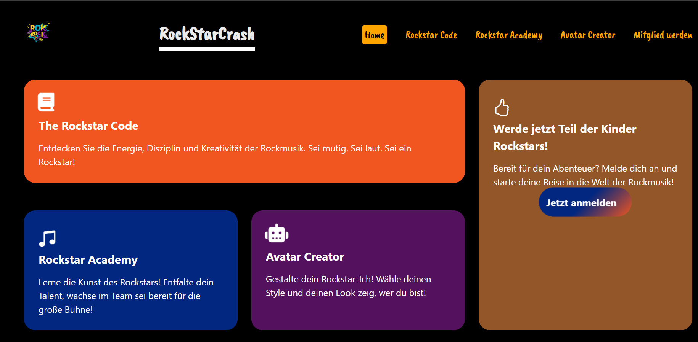
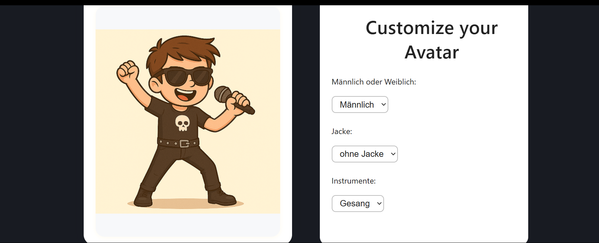
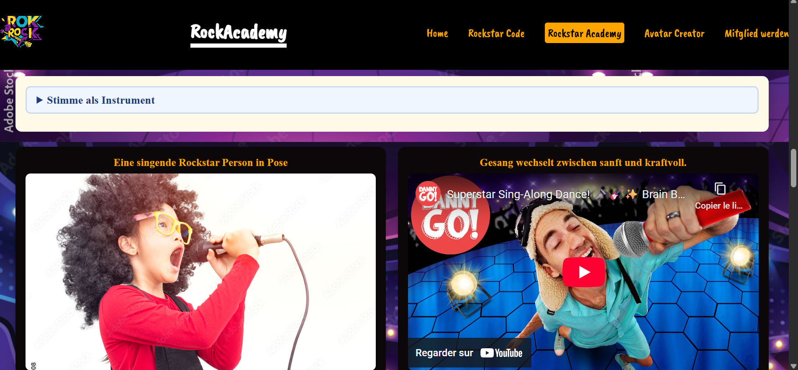
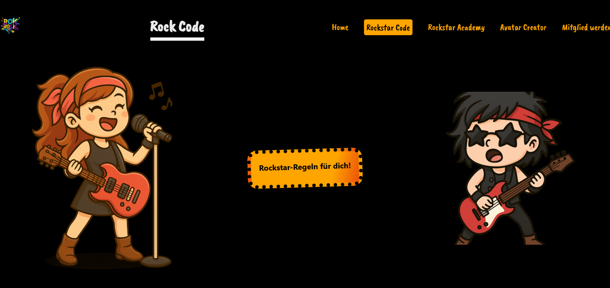

# Abschlussprojekt "Kinder Rockstars" – Projektanforderungen

##  Technik

- **Responsive Design**
  - Viewports: **375×667px bis 1920×1980px**
  - **Mobile-first** Ansatz

- **Layout**
  - **CSS Grid** für Gesamtseitenlayout
  - **Flexbox** für Navigation
  - Keine `float`-Layouts oder veraltete Box-Modell-Techniken

- **HTML**
  - Semantische Elemente (`<header>`, `<main>`, `<footer>`, etc.)
  - Trennung von Struktur (HTML) und Stil (CSS)
  - **W3C-validierter** und fehlerfreier Code

- **CSS**
  - Ein einziges externes Stylesheet für alle Seiten nach Möglichkeiten
  - Sinnvoll kommentierter Code

- **JavaScript**
  - Interaktionen über **DOM Event Listener**
  - Kein `onclick` im HTML

##  SEO & Social Media
- Optimierte Meta-Tags:
  - `<title>`, `description`, `keywords`, `author`
- Alle Bilder mit `alt`-Attribut
- Favicon eingebunden

##  Rechtliches
- Komplette **Eigenentwicklung**
- Inspiration durch Snippets erlaubt **(nur mit Quellenangabe & Lizenzprüfung)**

# STARCRASH– Interaktive Rockstar-Website für Kinder
*StarCrash* ist eine kreative, interaktive Lernplattform für Kinder zwischen 7 und 14 Jahren. Die Seite führt spielerisch in die Welt der Rockmusik ein: mit einem Avatar-Creator, einem Musik-Quiz, Stil-Elementen und einem Einblick in Rockmusik-Werte wie Mut, Teamgeist und Ausdruck.

## Live-Link
Projektadresse:  
http://mrtaff23.github.io/starcrash

## Projektübersicht
Die Website besteht aus mehreren thematischen Seiten, die modular aufgebaut sind:

### Seitenstruktur
- index.html – Startseite mit Überblick
- rockstar-code.html – Rockstar-Werte und Eigenschaften
- rockstar-academy.html – Vorstellung von Instrumenten & Lernen
- avatar-creator.html – Erstelle deinen eigenen Rockstar-Avatar
- mitglied-werden.html – Aufruf zur Teilnahme / Anmeldung

## Inhalte und Funktionen
- Avatar Creator mit Auswahl von Stil, Instrument und Kleidung
- Interaktives Quiz 
- Vorstellung realer Musiklegenden als Inspiration
- Open Graph Meta-Tags für Social Media Sharing
- Responsives Layout 
- Strukturierte Navigation und barrierearme Gestaltung

## Verwendete Technologien
- HTML5, CSS3, JavaScript 
- Font Awesome und Bootstrap Icons
- Google Fonts (Sofia)
- Open Graph (og:) Meta-Tags
- Barrierearme Semantik (z. B. ARIA-Labels, Alt-Texte)
-robots.txt 
-favicon

## Projektteam
Dieses Projekt wurde im Rahmen des Sommersemesters 2025 an der Hochschule Worms umgesetzt von:

- Anicha Zabrelle Dong Zankia  
- D. Wilfred Arnond Teu Dogmo  
- Henriette Landryne Yemtsap

-Seitenvorschau:

